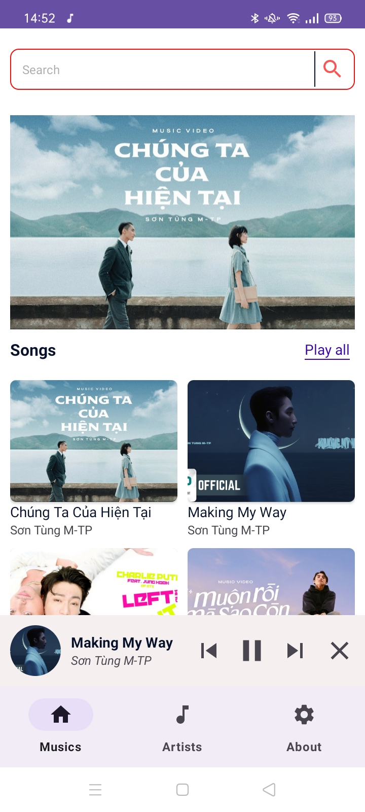
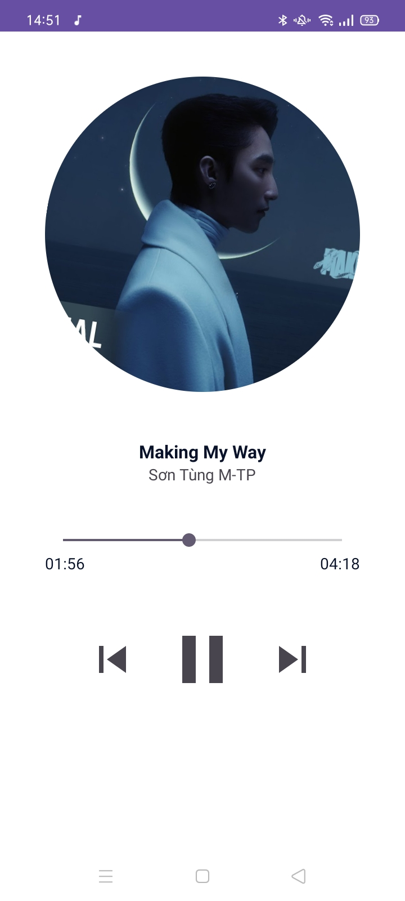
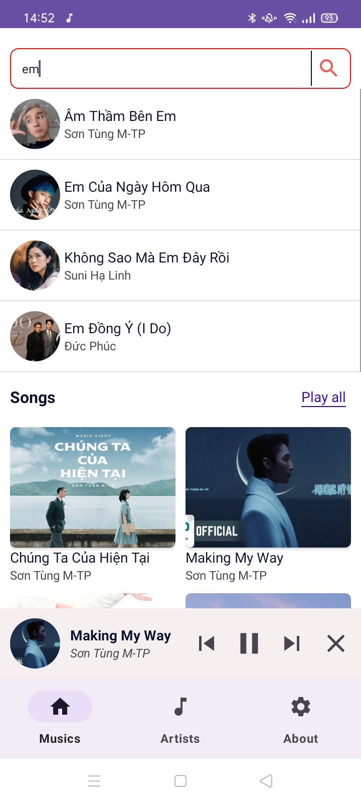
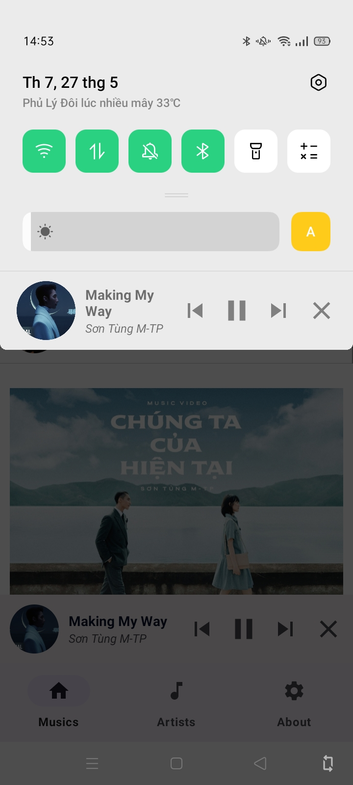
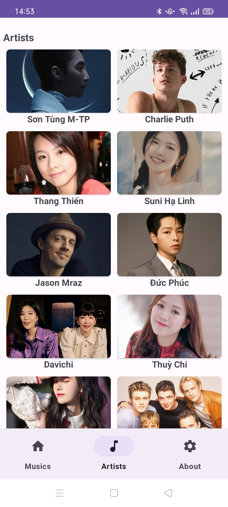

    
    <h1>Music Player</h1>
    
A simple Android music player application built with Kotlin

---

  
  
  
  
  
  

## Features
- Basic music player (play/pause/next/previous)
- Background playback
- Sort songs by artist
- Search for songs by name

## Contact
For any further questions, feel free to contact tranviethungpv@gmail.com
